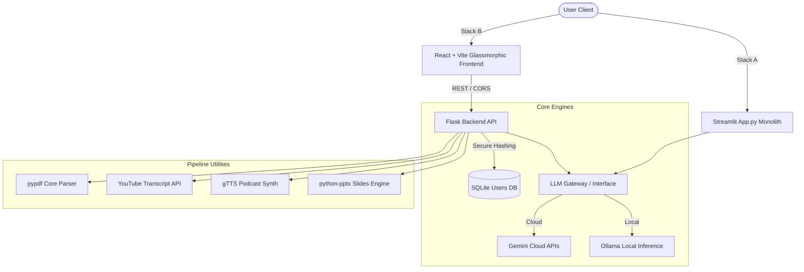

# 💬 IntelliDoc AI - Advanced Document Intelligence Platform

[](https://opensource.org/licenses/MIT)
[](https://www.python.org/)
[](https://react.dev/)
[](https://flask.palletsprojects.com/)
[](https://ollama.com/)
[](https://deepmind.google/technologies/gemini/)

IntelliDoc AI is a premium, next-generation document intelligence platform that bridges the gap between static documents and interactive, multi-modal intelligence. Moving beyond simple text extraction, it employs a **hybrid architecture** (Streamlit prototyping + high-scale React/Flask production app) powered by local and cloud Large Language Models (LLMs) to enable conversational document parsing, agentic tool usage, automated slides rendering, podcast creation, and real-time video intelligence.

---

## 🗺️ Table of Contents
- [🌟 Key Features](#-key-features)
- [🏗️ Architectural Architecture](#%EF%B8%8F-system-architecture)
- [🛠️ Tech Stack](#%EF%B8%8F-tech-stack)
- [🚀 Quick Start & Installation](#-quick-start--installation)
  - [Prerequisites](#prerequisites)
  - [1. Clone the Repository](#1-clone-the-repository)
  - [2. Backend Setup (Flask)](#2-backend-setup-flask)
  - [3. Frontend Setup (React + Vite)](#3-frontend-setup-react--vite)
  - [4. Stack A Setup (Streamlit Client)](#4-stack-a-setup-streamlit-client)
- [⚙️ Environment Configuration](#%EF%B8%8F-environment-configuration)
- [🎬 Project Demos & Workflows](#-project-demos--workflows)
- [🔒 Security & Authentication](#-security--authentication)
- [📄 License](#-license)

---

## 🌟 Key Features

### 1. 💬 Contextual PDF Chat (RAG)
* **High-Accuracy Processing**: Extracts clean content using `pypdf`.
* **Dynamic Semantic Q&A**: Uses context-injection to allow users to ask deep questions directly to their documents with token-by-token streaming responses.

### 2. 🤖 Autonomous AI Agent (Agent Mode)
* **Agentic Framework**: Leverages **Google Gemini-2.5-Flash** featuring native function calling.
* **Autonomous Tool Binding**: Resolves ambiguous user prompts by dynamically executing tools like live stock checkers, flight search APIs, and web search integrations in a self-correcting loops.

### 3. 📊 Automated Slide Deck Generation
* **JSON Structuring**: Distills PDFs into clean, presentation-ready JSON structures using Gemini.
* **Themed Rendering**: Employs a custom layout engine (`python-pptx`) to generate styled, presentation-ready `.pptx` slides automatically.

### 4. 🎙️ Two-Host Podcast Creator
* **Scripted Dialogues**: Translates complex, static PDF topics into dynamic, natural conversations between two virtual hosts.
* **Speech Synthesis**: Synthesizes scripting in real-time utilizing **Google Text-to-Speech (gTTS)**, mapped with distinct regional accents (e.g., US English vs. UK English) for realism.

### 5. 🎥 YouTube Video Q&A & Analysis
* **Transcript Extraction**: Integrates `youtube-transcript-api` using regex to instantly parse transcript streams.
* **Interactive Synergy**: Allows the user to summarize videos and chat interactively with any video transcript.

### 6. 🕸️ Visual Knowledge Graph
* **Relational Mapping**: Automatically translates complex, unstructured document text into interactive knowledge graphs, highlighting connected entities and structural patterns.

---

## 🏗️ System Architecture

IntelliDoc AI provides two execution pathways tailored to developer and scale requirements:



---

## 🛠️ Tech Stack

### Frontend & Clients
* **React 18 (Vite)**: Ultra-fast UI bundling.
* **Vanilla CSS**: Premium Glassmorphism styling, responsive sidebar layout, and dynamic transitions.
* **Streamlit**: Single-page Python monolithic layout for rapid prototyping.

### Backend & API
* **Flask**: Lightweight Python REST API engine with CORS-enabled endpoints.
* **gTTS**: Multi-accent Google TTS synthesis engine.
* **python-pptx**: Precise slide rendering layout compiler.

### Databases & Security
* **SQLite**: Serverless database for persistent storage.
* **PBKDF2 (SHA-256)**: Cryptographic salt-based hashing to protect user authentication credentials.

---

## 🚀 Quick Start & Installation

### Prerequisites
* **Python**: 3.10 or higher
* **Node.js**: v18 or higher (LTS recommended)
* **Ollama**: (Optional, for local model hosting)

### 1. Clone the Repository
```bash
git clone https://github.com/your-username/intellidoc.git
cd intellidoc
```

### 2. Backend Setup (Flask)
Create a Python virtual environment, activate it, and install dependencies:
```bash
# Create Virtual Environment
python -m venv .venv

# Activate Virtual Environment (Windows)
.venv\Scripts\activate

# Activate Virtual Environment (Mac/Linux)
source .venv/bin/activate

# Install Dependencies
pip install -r requirements.txt

# Launch Backend Server
python api.py
```
*The server will boot up locally at `http://localhost:5000/`.*

### 3. Frontend Setup (React + Vite)
Open a new terminal window, navigate to the `frontend/` directory, and launch the dev server:
```bash
cd frontend
npm install
npm run dev
```
*Open your browser and navigate to `http://localhost:5173/`.*

### 4. Stack A Setup (Streamlit Client)
If you prefer testing the all-in-one prototyping framework:
```bash
streamlit run app.py
```

---

## ⚙️ Environment Configuration

Create a `.env` file in the root directory (and `frontend/.env`) to map required credentials:

```env
# Cloud AI Credentials
GEMINI_API_KEY=your_gemini_api_key_here

# Local LLM API Base (Ollama Default)
OLLAMA_BASE_URL=http://localhost:11434

# System Constants
MODEL_NAME=gemini-2.5-flash
SECRET_KEY=your_flask_secret_key_here
```

---

## 🔒 Security & Authentication

IntelliDoc AI uses industry-standard hashing protocols:
* **Salted Hashes**: Every password is compiled with a cryptographically secure 32-byte salt (`os.urandom(32)`).
* **Work Factor**: Iterates PBKDF2 over 100,000 rounds using the SHA-256 algorithm to block brute-force attempts.
* **Secure Sessions**: Integrated with Flask's session management, mapping isolated cookie stores for cross-origin APIs.

---

## 📄 License

Distributed under the MIT License. See `LICENSE` for more information.

---

<p align="center">Made with ❤️ by the IntelliDoc AI Team</p>
